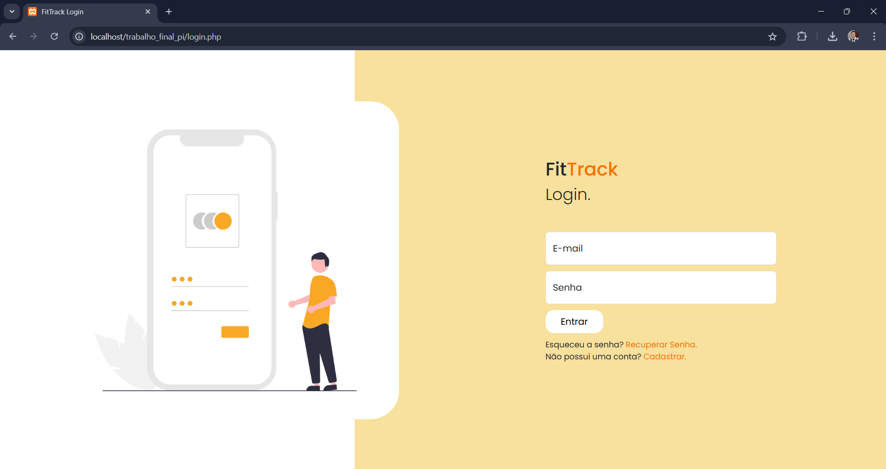
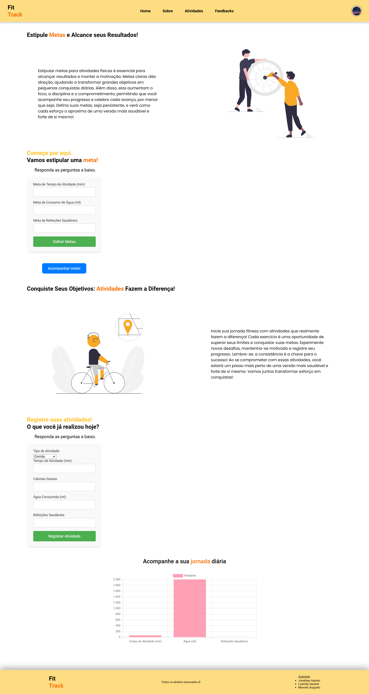
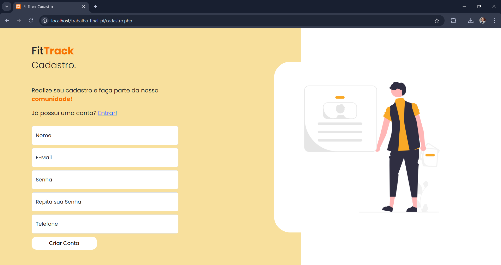
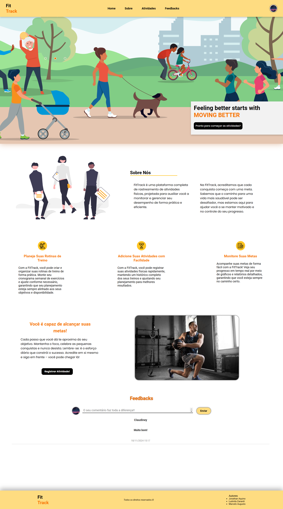
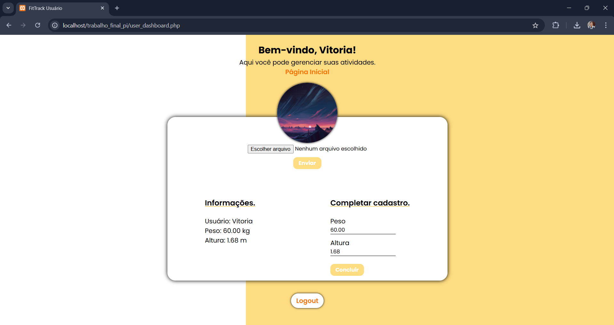
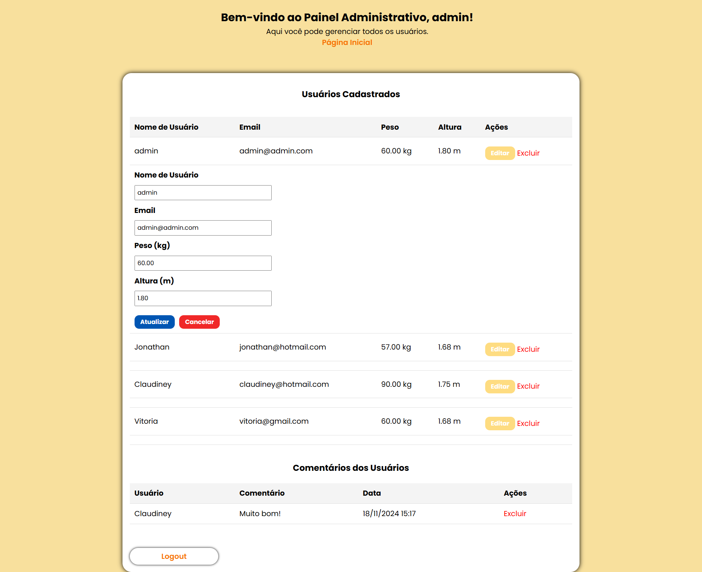

# 📊 **Plataforma de Rastreamento de Atividades Físicas**

Este projeto foi desenvolvido para a disciplina **Programação para Internet 2** do curso de **Sistemas de Informação** da **Universidade Federal de Uberlândia (UFU)**.

A aplicação web é uma **Plataforma de Rastreamento de Atividades Físicas**, permitindo que os usuários registrem, visualizem, editem e excluam atividades físicas, como corridas, caminhadas, treinos, entre outros.

---

## 👥 **Perfis de Usuário**

- **Admin**: Acesso completo à plataforma, incluindo controle dos registros de todos os usuários.
- **Usuário Comum**: Controle apenas sobre os próprios dados.

---

## 🚀 **Funcionalidades Principais**

### 🔒 **Cadastro e Login**
- Criação de contas (usuário comum ou administrador).
- Validação dos dados e **hashing de senhas** para garantir segurança.

> **Página de Login**  
> 

---

### 📝 **Gerenciamento de Atividades**

1. **Adicionar Atividade**  
   Permite que os usuários registrem atividades com detalhes, como:
   - Distância percorrida;
   - Duração da atividade;
   - Calorias queimadas.

2. **Visualizar Atividades**  
   Exibição organizada das atividades cadastradas.

3. **Editar Atividade**  
   Possibilidade de alterar registros existentes.

4. **Excluir Atividade**  
   Permite remover registros quando necessário.

---

###

> **Página de Atividade**  
>   

---

## 🔐 **Requisitos de Segurança**

- **Hashing de Senhas** utilizando técnicas seguras (ex.: **bcrypt**).
- **Validação de Entradas** para evitar:
  - **SQL Injection**
  - **XSS (Cross-Site Scripting)**

---

## 🛠️ **Tecnologias Utilizadas**

- **Front-end**: HTML, CSS, JavaScript  
- **Back-end**: PHP  
- **Banco de Dados**: MySQL  
- **Segurança**: bcrypt para hashing de senhas  

---

## ✨ **Capturas de Tela**

Aqui estão as principais páginas do sistema:  

1. **Página de Login/Cadastro**  
   
   

2. **Página Principal (Dashboard)**  
   

3. **Página de Gerenciamento de Atividades**  
   

4. **Página de Perfil do Usuário**  
   
   

---

## 👨‍💻 **Autores**

- **Jonathan Aquino**  
- **Ludmila Zanardi**  
- **Marcelo Augusto**
